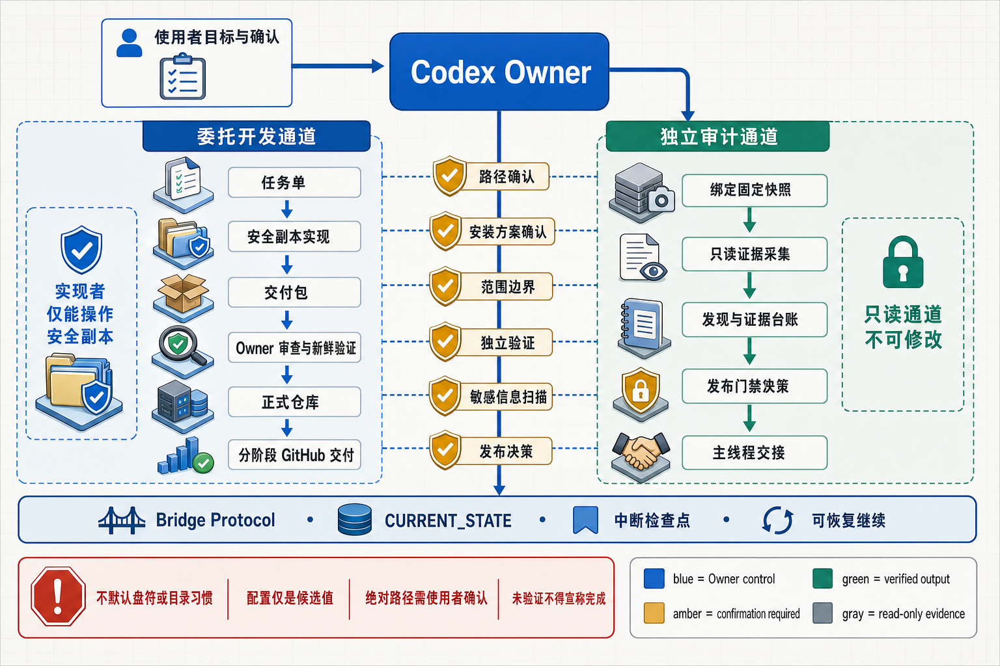

<p align="right">
  <a href="#english"><kbd>English</kbd></a>
  <a href="#中文"><kbd>中文</kbd></a>
</p>

<a id="english"></a>

# Owner Handoff Development Skill



A Codex skill for running delegated software development and independent evidence-first audits with a clear engineering owner, an isolated implementation copy when needed, snapshot-bound findings, fresh verification, release gates, and controlled handoff.

This skill is useful when you want Codex to act as the final engineering owner while another coding agent implements changes in a safety copy, or when Codex must audit a fixed repository/candidate snapshot without modifying it. It keeps architecture decisions, evidence, review, testing, release gates, handoff, and repository publishing in controlled lanes.

## What It Provides

- New-machine bootstrap guidance for detecting tools and confirming paths.
- Cross-platform path-confirmation gates for the formal repository, handoff container, safety copy, outputs, and tool installations.
- Task-file template for delegated coding work.
- Copyable implementer instructions.
- Delivery packet requirements: `summary.md`, `changed-files.txt`, `verification.md`, and `patch.diff`.
- Owner review and formal integration checklist.
- Independent repository audit and candidate-acceptance workflow with snapshot proof, evidence ledgers, gate decisions, manifest closure, and copy-ready main-thread handoff.
- GitHub repository delivery policy with local commit, remote push, draft PR, merge, and tag cadence.
- Bridge protocol and current-state templates.
- PowerShell environment inspection script.
- Interruption and resume policy for quota, rate-limit, or session cutoffs.

## Path Confirmation Gate

The skill has no default drive, mount point, repository root, tools directory, or folder naming convention. It must not turn values from memory, prior projects, the current computer, examples, or another user into universal defaults.

Before creating, cloning, copying, deleting, installing, or writing, Codex must display every affected absolute path and obtain the user's confirmation for the stated operation. A discovered config is candidate input only. Path confirmation and install-plan confirmation are separate gates.

## Install

After confirming the actual Codex skills directory for this installation, clone the repository with the skill folder name:

```powershell
git clone https://github.com/vanfuu/owner-handoff-development-skill.git "<confirmed_codex_skills_dir>\owner-handoff-development"
```

Restart or refresh Codex so the skill metadata is rediscovered.

## Usage

Ask Codex:

```text
Use $owner-handoff-development to bootstrap the environment, confirm formal and safety paths, then run delegated development with Owner review, tests, and GitHub integration.
```

Or for an audit:

```text
Use $owner-handoff-development to audit this fixed snapshot without source changes, close the evidence package, decide the release gate, and produce a copy-ready handoff.
```

For a new project, Codex should first read `references/environment-bootstrap.md`, run environment detection where appropriate, ask the user to confirm paths, then create the project bridge files.

## Validate

If you have the Codex skill validation helper available, run:

```powershell
python path\to\quick_validate.py path\to\owner-handoff-development
```

The included PowerShell environment inspector can perform safe read-only detection without assuming paths:

```powershell
powershell -NoProfile -ExecutionPolicy Bypass -File .\scripts\inspect_environment.ps1 -ProjectName "Demo Project" -Json
```

Candidate paths can be loaded from a config, then explicitly confirmed for the current operation:

```powershell
powershell -NoProfile -ExecutionPolicy Bypass -File .\scripts\inspect_environment.ps1 -ConfigPath "<absolute_config_path>" -ConfirmedPaths -Json
```

`-InstallMissing` generates a plan unless the user has separately confirmed that exact plan and `-ConfirmedInstallPlan` is also supplied.

Run the executable path-gate regression tests with:

```powershell
powershell -NoProfile -ExecutionPolicy Bypass -File .\tests\path-confirmation-gates.tests.ps1
```

Reusable external tools, project-specific tools, repositories, safety copies, handoff areas, and report outputs must all target user-confirmed absolute paths. No drive is treated as inherently preferred or forbidden.

## License

MIT. This license is intentionally permissive for a workflow/tooling skill: people can use it, modify it, fork it, and adopt it in commercial or private projects while preserving the copyright notice and disclaimer.

---

<p align="right">
  <a href="#english"><kbd>English</kbd></a>
  <a href="#中文"><kbd>中文</kbd></a>
</p>

<a id="中文"></a>

# Owner Handoff Development Skill（中文）

这是一个面向 Codex 的工程 Owner Skill，用于管理“安全副本实现 + Patch 交付”的委托开发，也用于“固定快照 + 独立只读审计 + 证据闭环 + 发布门禁 + 主线程交接”。

当你希望 Codex 负责最终工程判断，而让 Claude、DeepSeek 或其他代码 Agent 只在安全副本中实现具体改动，或者希望 Codex 在不修改源码的前提下审计固定仓库/候选包时，这个 Skill 可以把架构决策、证据、审查、测试、门禁、交接和仓库同步放进彼此边界清楚的受控流程里。

## 它提供什么

- 新电脑环境启动流程：检测工具、读取配置、确认路径。
- 跨平台路径确认门禁：覆盖正式仓库、协作容器、安全副本、输出目录和工具安装。
- 委托式代码任务单模板。
- 可直接复制给实现 Agent 的任务指令。
- 交付包要求：`summary.md`、`changed-files.txt`、`verification.md`、`patch.diff`。
- Owner 审查与正式集成清单。
- 独立仓库审计和候选验收流程：快照证明、证据台账、门禁决策、manifest 闭环与可复制主线程交接。
- GitHub 仓库交付策略，区分本地提交、远端推送、draft PR、合并和 tag 的节奏。
- 记忆桥协议与当前状态模板。
- PowerShell 环境检查脚本。
- 针对额度、限流或会话中断的断点记录与恢复规则。

## 路径确认门禁

Skill 不预设默认盘符、挂载点、仓库根目录、工具目录或文件夹命名方式。来自记忆、历史项目、当前电脑、示例或其他使用者的路径习惯，都不能被提升为通用默认值。

在创建、克隆、复制、删除、安装或写入之前，Codex 必须展示所有受影响的绝对路径，并取得使用者对本次操作范围的明确确认。自动发现的配置文件只提供候选值。路径确认与安装方案确认是两道独立门禁。

## 安装

先确认本次安装实际使用的 Codex skills 目录，再克隆仓库，并保持 skill 文件夹名为 `owner-handoff-development`：

```powershell
git clone https://github.com/vanfuu/owner-handoff-development-skill.git "<confirmed_codex_skills_dir>\owner-handoff-development"
```

然后重启或刷新 Codex，让它重新发现 Skill metadata。

## 使用方式

对 Codex 说：

```text
Use $owner-handoff-development to bootstrap the environment, confirm formal and safety paths, then run delegated development with Owner review, tests, and GitHub integration.
```

审计场景也可以这样说：

```text
Use $owner-handoff-development to audit this fixed snapshot without source changes, close the evidence package, decide the release gate, and produce a copy-ready handoff.
```

对于新项目，Codex 应先读取 `references/environment-bootstrap.md`，在合适情况下运行环境检测，要求使用者确认路径，然后再创建项目交接文件。

## 验证

如果你有 Codex skill 校验工具，可以运行：

```powershell
python path\to\quick_validate.py path\to\owner-handoff-development
```

也可以在不假设任何路径的情况下运行内置 PowerShell 环境检查脚本：

```powershell
powershell -NoProfile -ExecutionPolicy Bypass -File .\scripts\inspect_environment.ps1 -ProjectName "Demo Project" -Json
```

从配置读取候选路径后，只有在使用者确认本次操作所涉及的精确路径时，才能传入：

```powershell
powershell -NoProfile -ExecutionPolicy Bypass -File .\scripts\inspect_environment.ps1 -ConfigPath "<absolute_config_path>" -ConfirmedPaths -Json
```

仅使用 `-InstallMissing` 只会生成安装方案；使用者还必须单独确认该方案，并同时传入 `-ConfirmedInstallPlan`，脚本才允许执行安装。

可执行的路径门禁回归测试：

```powershell
powershell -NoProfile -ExecutionPolicy Bypass -File .\tests\path-confirmation-gates.tests.ps1
```

可复用工具、项目专用工具、正式仓库、安全副本、交接区和报告目录都必须使用使用者确认过的绝对路径。Skill 不把任何盘符视为天然优先或天然禁止。

## 许可证

MIT。这个许可证对流程类和工具类 Skill 很友好：别人可以自由使用、修改、fork，并用于商业或私有项目，同时保留版权声明和免责声明。
